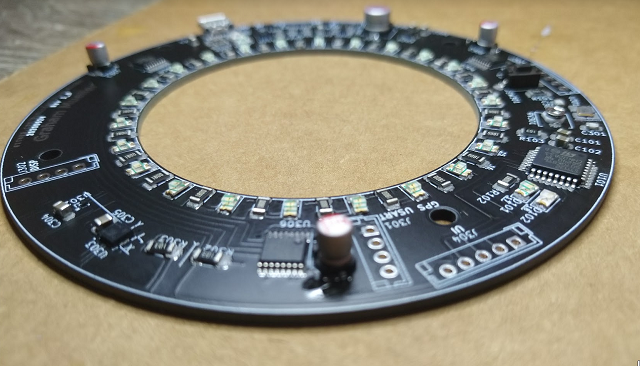

WIP !

# PROJECTS

### » [Star Gazer](https://github.com/Muellegr/Star_Gazer)
Ongoing fall-2020 project.
A handheld device that when pointed at a star or constellation, will display information about it.

Goal is to gain experiance with picking, flashing, and using a microcontroller from scratch.  
Other goals are using sensitive and small components such as gyrometers and magnometers for sensor information.

PCB complete and assembled.  Currently writing prototype software!
[Case](https://github.com/Muellegr/Star_Gazer/wiki/Case)

![PCB]2(assets/StarGazer/pcb_top.png)
* * *

### » [FPGA - Max 10 SDRAM Controller](https://github.com/Muellegr/FPGA-Max10-SDRAM-Project-1)
A summer 2019 solo project.
SDRAM controller written in System Verilog.  
Initalizes, writes, and reads with a startup test and optional unit test.

Learned a lot from reading datasheets for timing, writing in System Verilog, and overall planning.
* * *

### » [OSU Junior Design - FPGA Music Box ](https://github.com/Muellegr/MusicBox-Quartus-Project)
OSU Junior Design to devolop a device that could record and play back sythensized sound using only an FPGA.

I was in charge of the FPGA programming in System Verilog.  
Major systems include
* SPI controller
* Signal generators for a sine, triangle, square waves with variable frequency
* SDRAM controller interface
* State controller
* PWM controller for lighting
* Clock generators

* * *

#### » Shoulder Bluetooth Radio
I like do do workouts on a bike around the local trails.  Some of these may end up being an hour of hard work going uphill.  In silence.  
This project was to create a small speaker connected to an ESP32 microcontroller, which would be connected to my phone over bluetooth.
This was my first PCB and done without any prior experiance.
Todo
Project failed - PCB was a success, however not designing the case made it easy to put down and forget about.
* * *

#### » GameDev Stuff
Todo
* * *